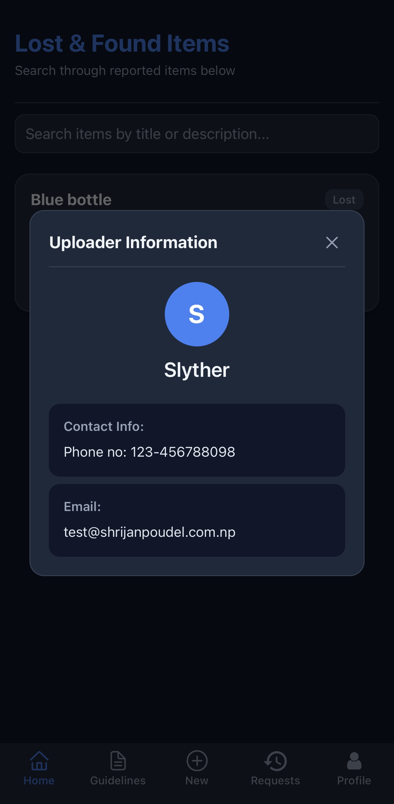

# 🧢 Lost & Found App

A simple and useful mobile app built for my high school to help students and staff easily report lost or found items around campus.

## 📱 About the App

Whether you've misplaced your water bottle or found someone else's calculator, this app helps you post a request in seconds. It's designed to make it easy for our school community to connect and return lost items.

## 🔧 Features

- Add a new "Lost" or "Found" post with item details  
- Categorized submissions  
- Firebase Firestore for storing posts  
- Smooth UI with React Native + Nativewind  

## 🛠 Built With

- [React Native](https://reactnative.dev/)  
- [Firebase Authentication](https://firebase.google.com/docs/auth)  
- [Firebase Firestore](https://firebase.google.com/docs/firestore)  
- [React Nativewind](https://www.nativewind.dev/) for styling  

## 🎯 Purpose

I built this app as one of my first projects to learn by building. I learned the fundamentals of React Native, Firebase, and Firestore side by side while building this app to solve a real problem at school. **Anyone can fork and use it for their own school.**

## 🤝 Open Source & Contributions

This project is completely open source and I encourage anyone to fork, adapt, or contribute to it for their own school or community. I’m open to suggestions, feedback, and ideas!

📩 Contact me at **[contact@shrijanpoudel.com.np](mailto:contact@shrijanpoudel.com.np)**  
---

## 📸 Screenshots

  
  
  
  
  
  
  

---

